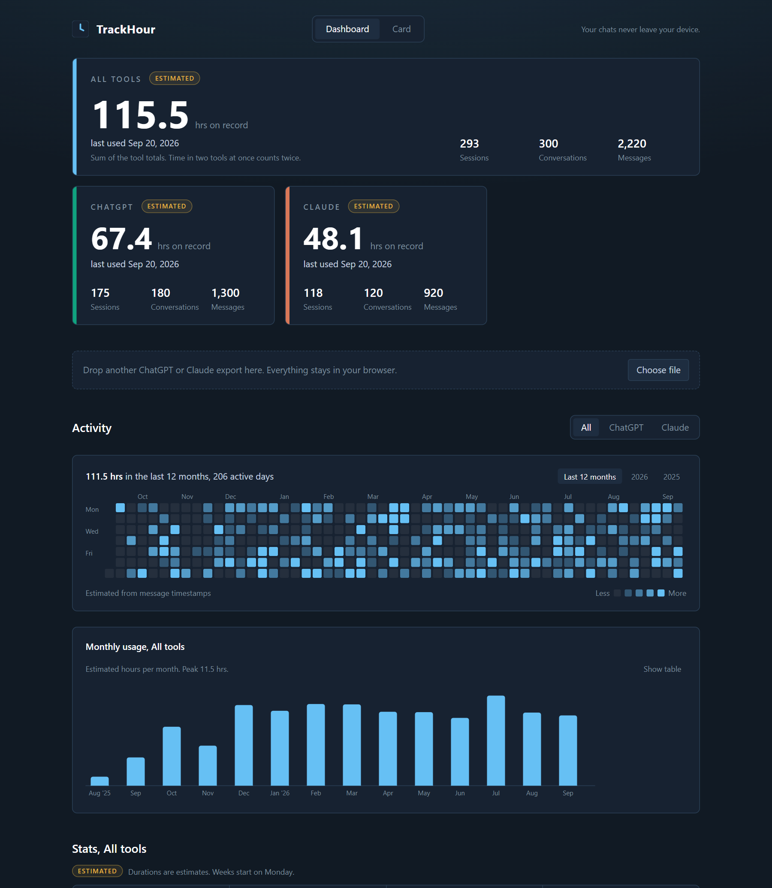
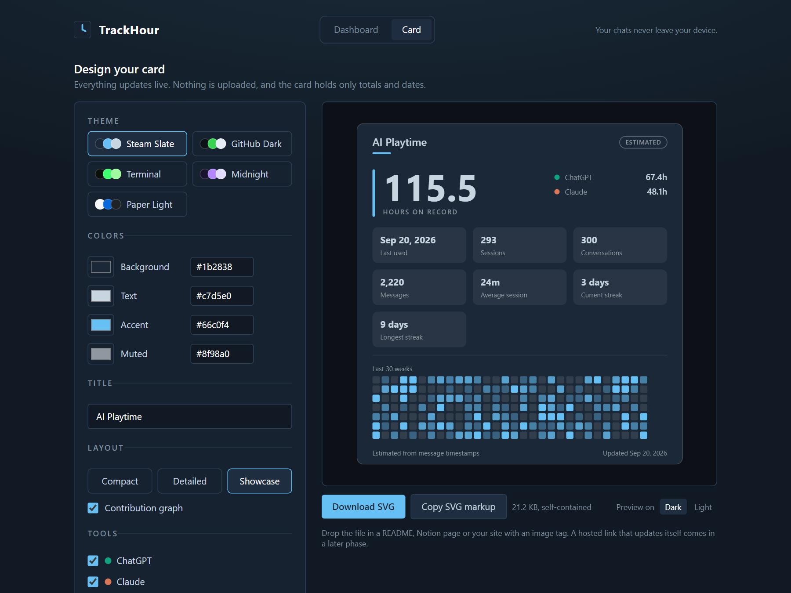
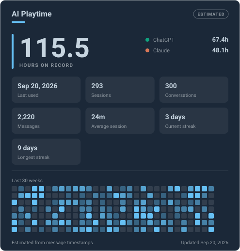
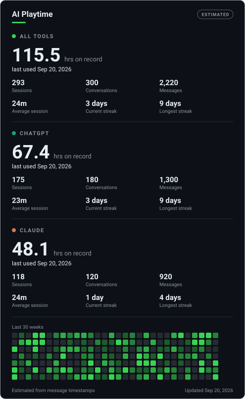

# TrackHour

**Steam profile stats, but for AI usage.** Import your ChatGPT and Claude history, see how long you have really spent with each tool, design a card, and embed it anywhere images render: a GitHub README, a portfolio, Notion, your own site. Same genre as github-readme-stats and WakaTime badges.

**Live site:** https://your-project.vercel.app *(placeholder, replace after deploying)*





*Screenshots use generated demo data, not a real account.*

### Card examples

Every card is one self-contained SVG. These are the actual files the designer produces ([`docs/examples/`](docs/examples)):






Everything happens in your browser. No account is needed to import, see your stats, or design and download a card. An optional account only adds a hosted card link.

## Privacy

Your chats never touch our servers. This is a hard guarantee, not a promise, and you can check it yourself.

- **Parsed in your browser.** Your export ZIP is opened and read locally with JSZip.
- **Only timestamps and counts are extracted.** Message text, conversation titles and file contents are never copied out of the export, never stored, and never sent anywhere. A unit test fails if a text field ever appears in the stored data.
- **Stored on your device.** Imported data lives in your browser's IndexedDB. "Wipe everything" in the app deletes it.
- **Importing never touches the network.** Parsing and stats run locally and no request is made with your data.
- **The one exception is opt-in.** If you sign in and press "Save my totals" to get a hosted card link, only aggregates are uploaded: your card design, totals per tool, and daily minutes for the last 30 weeks. The Account page shows the complete payload before you save, and "Delete from server" removes it. Never raw files, messages, titles, or per-message timestamps.
- **The browser enforces it.** The deployed site sends a `Content-Security-Policy` that only allows connections to itself and Supabase, so the page cannot send data anywhere else. Open DevTools, watch the Network tab, and see for yourself.
- **Open source.** Read the parsing code in [`core/src/parse`](core/src/parse).

There is no "connect your AI account" feature and there never will be. Neither OpenAI nor Anthropic offers an API to pull your chat history or usage time. Your history comes from the export ZIP that each service lets you download.

## What you get

- **Dashboard:** hours on record and last used per tool, a combined total, a GitHub-style heatmap, a monthly usage chart, and the full stat list (streaks, busiest weekday, sessions, messages, averages and more).
- **Card designer:** a live SVG preview. Choose a theme or your own colors, which stats and tools to show, and a layout: `compact` (one-line badge), `detailed` (a panel per tool), or `showcase` (a big hero number with stat tiles). Download the SVG or copy its markup.
- **Honest numbers:** every duration from an import is labeled **estimated**, on the dashboard and on the card, because an export only says when a message was sent.

### Get your export

- **ChatGPT:** Settings, Data controls, Export data. You will get an email with a ZIP.
- **Claude:** Settings, Privacy, Export data. You will get an email with a ZIP.

Drop the ZIP (or the `conversations.json` inside it) onto the page.

### How hours are estimated

Timestamps show when messages were sent, not how long you were reading. So per tool, all message timestamps are sorted; a new session starts after a gap longer than 15 minutes; a session lasts from its first to its last message; very short sessions are raised to a 1 minute minimum; and the total is the sum. Both thresholds are adjustable in the app. Known biases (reading the last reply is uncounted, long thinking pauses count) are documented in the app and in [`core/src/sessionize.ts`](core/src/sessionize.ts).

### Use your card

Download `ai-playtime-card.svg`, commit it to your repo, and reference it like any image:

```md

```

The SVG is fully self-contained (inline styles, system fonts, no external assets), so it looks the same everywhere. A hosted link that updates itself is planned for phase 2.

## Local development

You need Node 20 or newer and [pnpm](https://pnpm.io).

```bash
pnpm install
pnpm dev          # start the web app
pnpm test         # unit tests for core (parsing, sessions, stats, card renderer)
pnpm typecheck
pnpm build        # static build into web/dist
```

No environment variables are needed to run the app. Accounts are optional; see [`supabase/README.md`](supabase/README.md) to enable them.

## Project layout

| Folder | What it is | Status |
| --- | --- | --- |
| [`core/`](core) | Pure TypeScript: export parsing, sessionization, stats, the SVG card generator, shared types. No DOM, no network. | Built |
| [`web/`](web) | The Vite, React, TypeScript and Tailwind app: import, dashboard, card designer. | Built |
| [`card/`](card) | Hosted card endpoint logic: validation, caching, rate limiting, Supabase store. | Built and tested |
| [`supabase/`](supabase) | Profiles schema with row level security. Aggregates only. | Schema written, needs setup |
| [`extension/`](extension) | Opt-in Chrome extension for live active time. | Phase 3 stub |
| [`claude-code-hook/`](claude-code-hook) | Claude Code hook for sessions and lines changed. | Phase 3 stub |

`core` is written so the future endpoint and extension can reuse it verbatim.

## Deploy to Vercel

1. Import the repository in Vercel.
2. Set **Root Directory** to `web`. The framework preset is detected as Vite.
3. Leave **Include source files outside of the Root Directory** enabled (the default). The app imports `core/` and `card/` from the parent folder.
4. Optional, to enable accounts and hosted cards, add environment variables (see [`supabase/README.md`](supabase/README.md)): `VITE_SUPABASE_URL` and `VITE_SUPABASE_ANON_KEY` for the site, and `SUPABASE_URL` and `SUPABASE_ANON_KEY` for the `/api/card` function. All four are public values. **Never add the `service_role` key anywhere.**
5. Deploy.

Without the variables it is a plain static site. [`web/vercel.json`](web/vercel.json) rewrites app routes (such as `/card` and `/account`) to `index.html`, leaves `/api` to the function, and sets the security headers described above. If the install step cannot see the workspace, set the Install Command to `cd .. && pnpm install --frozen-lockfile`.

## Roadmap

1. **Phase 1 (this repo today):** everything above, 100% client-side.
2. **Phase 2 (built, needs your Supabase setup):** GitHub sign-in, saving aggregates, and a hosted card endpoint (`/api/card?u=name`) with caching and rate limiting. Only aggregate numbers are ever stored server-side.
3. **Phase 3:** an opt-in Chrome extension that measures live active time on claude.ai and chatgpt.com, a Claude Code hook for sessions and lines changed, and Discord integrations that reuse the same card (Rich Presence through the extension, and a bot or webhook that posts the card as an embed).

## Contributing

Issues and pull requests are welcome. Before opening a PR, run `pnpm test` and `pnpm typecheck`. A few ground rules keep the project trustworthy:

- **Keep `core/` pure.** No DOM, no network, no clock reads (pass `now` in). Add tests for anything you add.
- **Never store message text or titles.** Parsers may only extract timestamps and counts. The privacy test in `core/test/parse.test.ts` must keep passing.
- **No OAuth-to-AI-provider flows.** Data comes from export ZIPs and, later, the opt-in extension. (Signing in to this site with GitHub is fine; connecting to ChatGPT or Claude is not a thing.)
- **Only aggregates leave the browser, only when the user opts in.** Never the `service_role` key in client code.
- **Label data honestly.** Estimated and measured numbers are never silently mixed.
- **No em dashes in UI copy.**

Adding a card theme is a small change: add an entry to [`core/src/card/themes.ts`](core/src/card/themes.ts) and its key to `THEME_KEYS`.

## License

[MIT](LICENSE)
